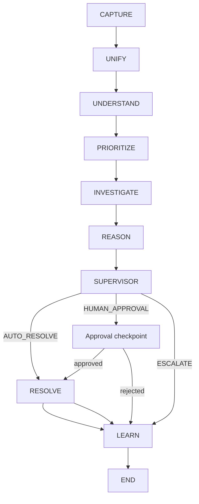

# ResolveIQ Orchestration

ResolveIQ coordinates the existing UnderstandingAgent, ResolutionAgent, and SupervisorAgent through an explicit persisted complaint graph.

`ComplaintWorkflowState` is a Pydantic, JSON-serializable checkpoint containing complaint and customer summaries, analysis, priority, investigation, policy evidence references, resolution, supervisor routing, approval, errors, stage, status, and retry count. Large prompts and raw model responses are excluded.

The graph delegates interpretation to the three existing agents. Deterministic services perform customer unification, priority scoring, complaint investigation, incident detection, policy retrieval, mock enterprise actions, and learning updates. Agents never access the database directly.

Every node writes a `WorkflowEvent` and ARC event. Unique workflow/node idempotency keys prevent duplicate event records. `WorkflowRun` stores the current node, compact state, status, and retry count. Human approval sets `pending_approval` and resumes at `RESOLVE`; it does not rerun completed nodes. Retry resumes a failed checkpoint and increments the bounded retry counter.

Supervisor guardrails remain authoritative: legal, fraud, safety, and regulatory language escalates; missing policy evidence, human-review flags, high compensation, or SLA risk require approval. Auto-resolution is only available after grounded resolution output and supervisor approval.

Workflow endpoints are available under `/api/v1/workflows`: run a complaint, inspect a checkpoint, resume approval, retry, cancel, and list events. The current action executor is intentionally a mock boundary for refunds, replacements, and notifications.