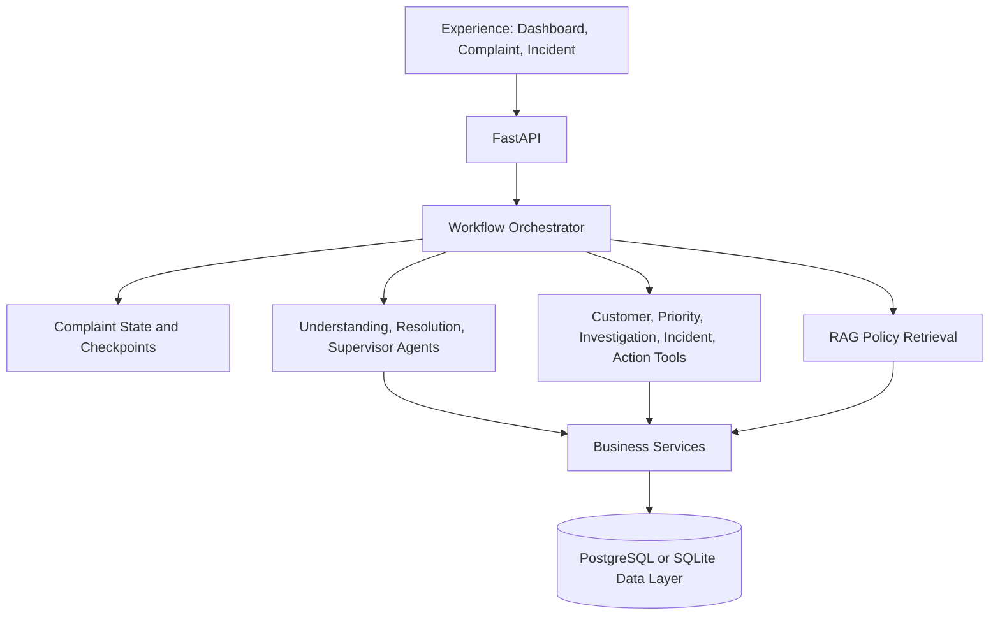

# Architecture

## High-Level Design

ResolveIQ is a persisted complaint decision workflow. The API starts an orchestrator checkpoint; the orchestrator calls narrow agents, deterministic tools, business services, and RAG; the data layer stores state, evidence, actions, and audit events.



## Layers

### 1. API Layer (FastAPI)
- RESTful endpoints for all operations
- OpenAPI documentation
- Request/response validation (Pydantic)
- Error handling and logging

### 2. Service Layer
- Business logic extraction
- Database operations
- Agent invocation
- Result aggregation

### 3. Agent Layer
- Specialized processors for each workflow stage
- Stateless operations (easier to scale)
- Deterministic business rules
- LLM abstraction calls

### 4. Data Layer
- PostgreSQL for relational data
- Vector database for similarity search
- Redis for caching
- Audit logs

## Data Flow

```
Complaint Received (API)
         ↓
    Services
         ↓
    Persisted Workflow Run
         ↓
    CAPTURE → UNIFY → UNDERSTAND → PRIORITIZE
         ↓
    INVESTIGATE → REASON → SUPERVISOR
         ↓
    AUTO / HUMAN APPROVAL / ESCALATE
         ↓
    RESOLVE → LEARN
```

## Deterministic vs Probabilistic

### Deterministic (Business Rules)
- SLA calculation
- Priority thresholds
- Compensation limits
- Status transitions
- Validation rules

### Probabilistic (AI Reasoning)
- Sentiment analysis
- Classification
- Summarization
- Semantic similarity
- Root cause hypothesis
- Recommendation generation

This separation ensures reliability while leveraging AI strength.

## Extensibility

### Adding a New Agent

1. Create agent in `backend/app/agents/{agent_name}.py`
2. Define input/output schemas
3. Inject into service layer
4. Add API endpoint if needed
5. Add tests

### Adding a New Knowledge Source

1. Create document loader
2. Implement chunking strategy
3. Generate embeddings
4. Store in vector database
5. Update retrieval strategy

### Integrating New LLM Provider

1. Create provider adapter in `backend/app/core/llm/`
2. Update LLMClient interface
3. Add configuration
4. Update .env.example
5. Add tests

## Scalability Considerations

- Stateless services for horizontal scaling
- Database connection pooling
- Redis for distributed caching
- Celery for async job processing (future)
- Message queues for high volume

## Security

- API key management via environment variables
- Input validation at API boundary
- Output validation from LLMs
- Audit trail of all actions
- No PII in logs (configurable)
- CORS configuration
- Rate limiting ready

## Performance

- Database query optimization with indexes
- Caching strategies for frequently accessed data
- Batch processing for bulk operations
- Lazy loading of relationships
- Query result pagination
